# Internet Database Development 2023

## 个人作业1——Web前端初探

### 学号：2111408 	姓名：周钰宸	专业：信息安全

### 一.作业要求

1. 针对任意网页，**调研其不同方式请求**。至少包括get、post请求，写出或截图其请求及相应数据包。
2. 针对任意网页，使用**JQuery**，能够触发某一事件。写出至少二条语句，截图响应前后不同的状态。
3. 完成一个**浏览器插件**，功能不限，文档中写明功能及代码。

### 二.网页不同请求方式调研

这里考虑到由于POST和GET请求经常出现在一些网站的用户登录过程中，**因此在这里选择了GitHub作为调研网页不同请求方式的对象**，以**我自己*@ErwinZhou***，登录和一些访问页面的过程为例。

#### 2.1 POST请求

首先来到最开始的Sign in登陆页面，输入我的邮箱和密码后，通过**F12打开右侧谷歌浏览器的实时窗口，开始抓取网页交互的包。**


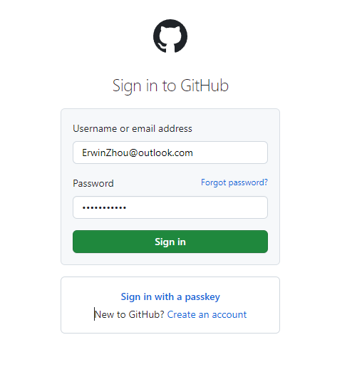

捕获结果如下图所示，此时就来到了Two-factor认证阶段，不过可以看到刚才输入邮箱和密码登陆成功后，**右侧交互界面成功捕获到了名为session的网络包。并且它采用的是POST请求方式。**


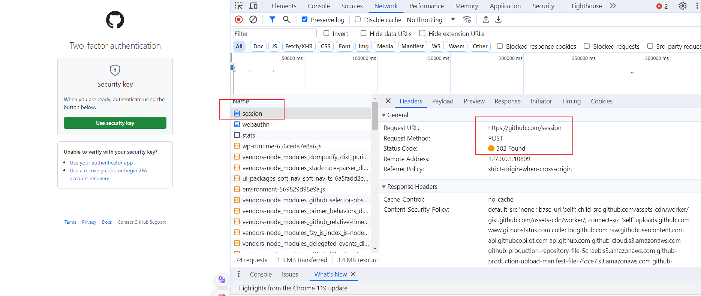

在Web开发中，**浏览器的“session”是指在用户与网站进行交互期间创建的会话状态。**当用户首次访问网站时，服务器会为其分配一个唯一的会话ID，并将其存储在用户的浏览器中。**在会话期间，服务器可以使用该会话ID来跟踪用户的状态和活动，例如登录状态、购物车内容等。**会话通常在用户关闭浏览器或注销时结束，或者在一段时间内没有活动时过期。会话可以通过浏览器的cookie或URL重写来实现。

另外这里的**HTTP状态码302表示临时重定向**。服务器将客户端的请求重定向到另一个地址，客户端需要重新发送请求到新的地址。也就是说我再登陆过程中，成功登陆后的请求被临时重定向到https://github.com/session下，目的将此时的我的用户名和密码等登陆状态保存起来，作为一个session。

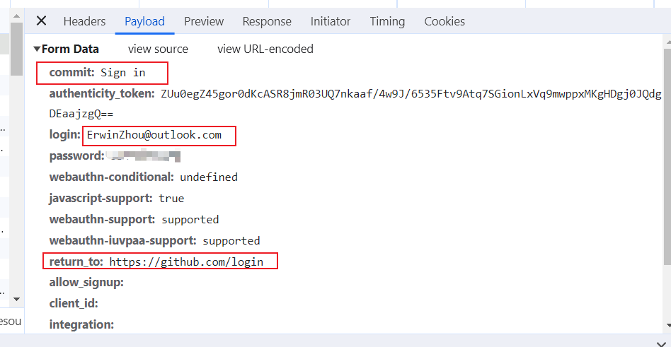

打开session的Payload数据包可以看到里面，对应的一些重要内容：

* **commit状态：**Sign in。即记录我登录的提交状态。
* **login:**ErwinZhou@outlook.com。即记录我登陆的邮箱。
* **password：**为了安全起见，我打码了。~~（不好意思，怕被盗号）~~即为了保存我的登陆密码。
* **return to:** https://github.com/login。即重定向结束，返回登陆界面。

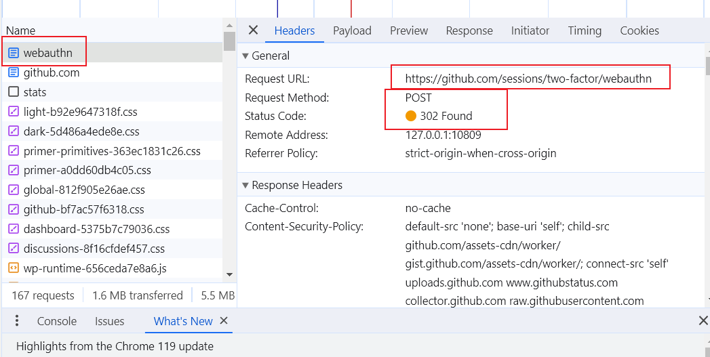

同样的我**在使用了two-factor登录后，也捕获到了新的POST请求数据包名为webauthn。**同样是通过302Found的状态码，临时重定向到sessions下的webauthn，目的很可能是也是把我的two-factor登录状态保存在会话sessions当中。这里的数据包就不再展示了。

可以看到，**这两个登陆状态都使用的是POST请求，**这是因为**<font size=3, color="red">GET请求将参数暴露在URL中，容易被窃取和篡改，而POST请求将参数放在请求体中，相对安全一些。甚至可以注意到，GitHub还使用HTTPS协议来加密传输数据（任何请求都是用https开头），HTTPS通过CA申请证书的安全层SSL协议的方式进一步保证了安全性。</font>**

#### 2.2 GET请求方式

同样是在使用two-factor登陆成功后，来到了github主页，可以看到此时除了上述提到的webauthn，**还捕获到了名为github.com的网页即HomePage**，这个就是服务器向我们浏览器传输到的网页包。**看到此时采用的是GET请求。并且200OK的状态码代表了请求的成功。**

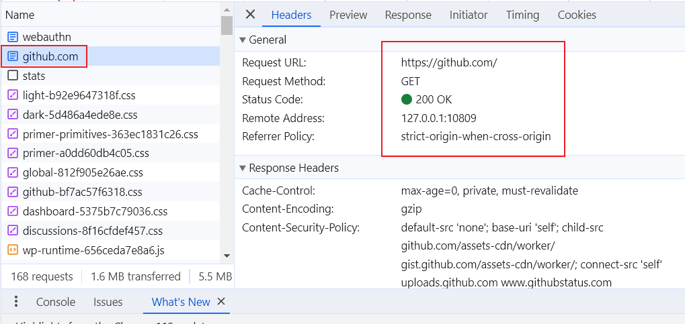

接下来我们来到我自己的主页，点击Profile来到我的个人信息处。可以到此时**捕获到了名为ErwinZhou的数据包，因为这个是我Github名字也是我的英文名字，也就是我的主页名称。同样是通过GET请求和200OK的状态码。**

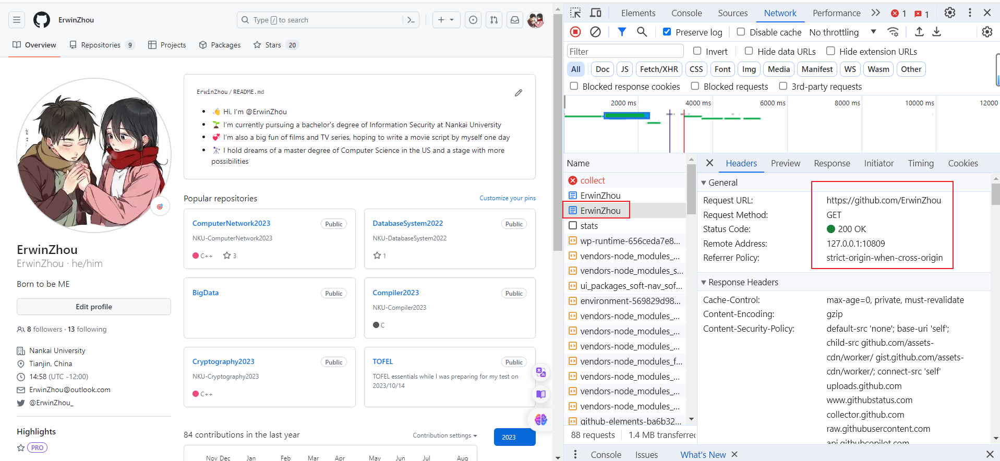

**来到Response详细查看其响应内容，能看到其中包含了一些关键信息：**

* 默认使用的GMT时间记录方式：GMT（Greenwich Mean Time）是指格林威治标准时间。
* **经过认证邮箱名字：**包含163，proton，nankai和**标注了selected的ErwinZhou@outlook.com，这些是请求获取到的我的邮箱信息，服务器通过数据包的方式发送到了浏览器。**

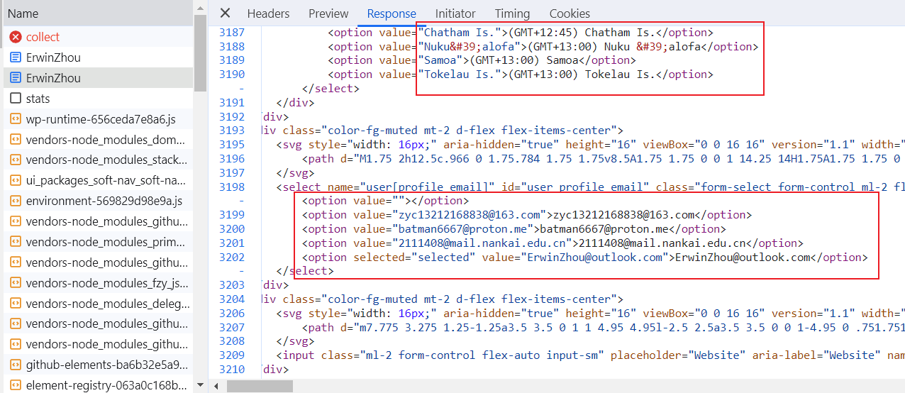

类似地，我们选择进入一个我建立好的仓库，就选择了**本次课程的仓库Internet Database Development 2023**，来到仓库后，看到了**右侧捕获到了和仓库同名的GET请求数据包和200OK的状态码。**

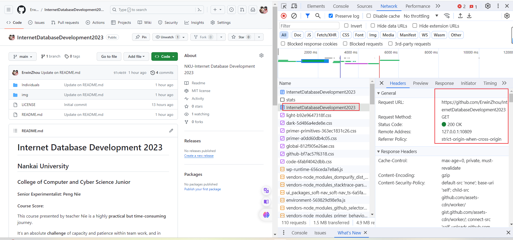

查看其数据包内容Response，**看到了我的用户名和对应的仓库名字信息，保存在了Response响应头中。**

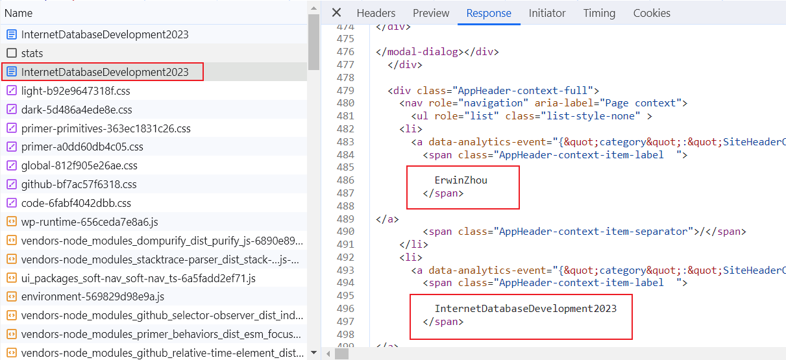

最后，再来看看其他的信息，还发现传输了一个图片，**这个就是我的GitHub头像，打开后也是GET的1请求方式和200的状态码。**

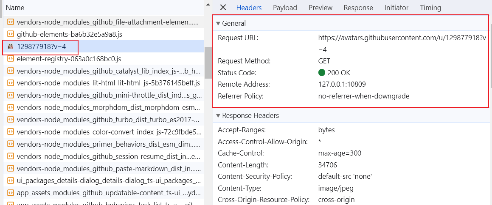

**直接打开其Preview，就能看到服务器那里保存传输过来的图片头像啦~**

~~艾笠呜呜呜~~

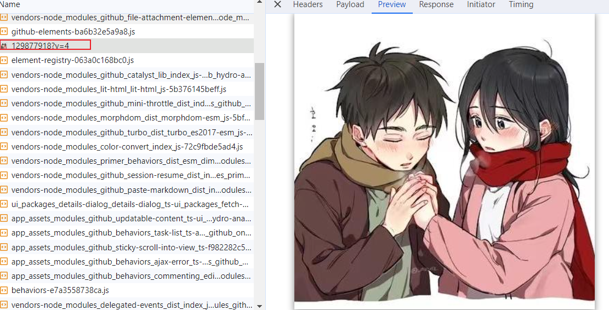

到此，调研结束。可以发现，**对于比较重要的用户登录信息，Github采取了POST的请求方式将比如用户名密码之类的信息进行了传送浏览器，不放在URL中，将参数放在请求体，只有通过Payload查看其请求体才能看到，这样非常安全；而对于图片，页面，仓库这种信息，直接GET请求即可。但无论是哪种，均是基于HTTPS的应用层协议，GitHub底层就保护着我们的代码，为我们提供着安全。**

### 三.JQuery

#### 3.1 更改对话框内容

为了更方便地使用JQuery~~(其实是为了整活)~~，我这里选择使用**OpenAI旗下的ChatGPT**，进行尝试，首先登陆后来到主页面：

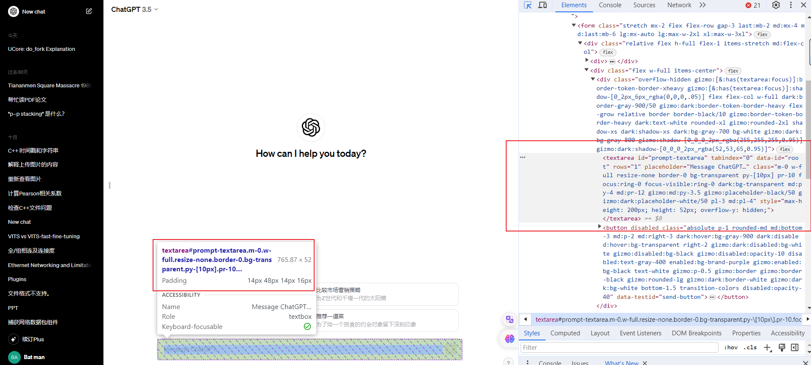

通过F12的开发者模式左上角的小箭头头定位页面正下方的对话框，可以获取该item的信息，通过提示发现其**对话框是一个textArea类型。id为"prompt-textarea"**。为了修改其内容，我们需要**编写对应改变其值的JQuery代码**：

```javascript
$("#prompt-textarea").value="呜呜小机器人，帮帮我互联网数据库大作业怎么写呀？"
```

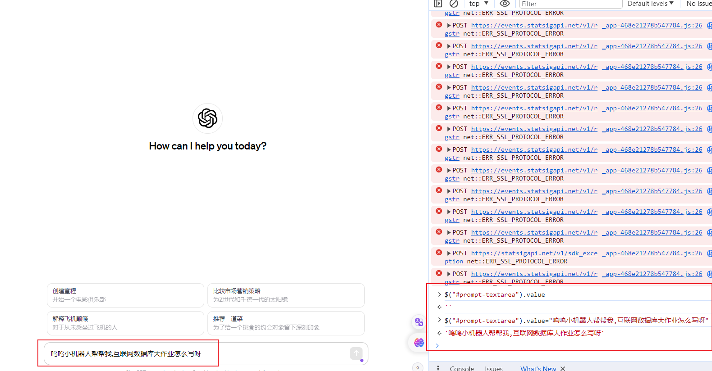

如上图所示，最开始查看其内容value是为空' '，然后**通过在控制台输入上面对应修改搜索内容的代码后，可以看到在左面对话框的内容被改变了。实现成功。**

#### 3.2 发送对话内容

为了想办法将上面的对话发送，我们首先想到应该通过点击旁边的发送按钮来发送。不过可以注意到：这个位置的按钮一直是灰色的，实际上我们定位一下：

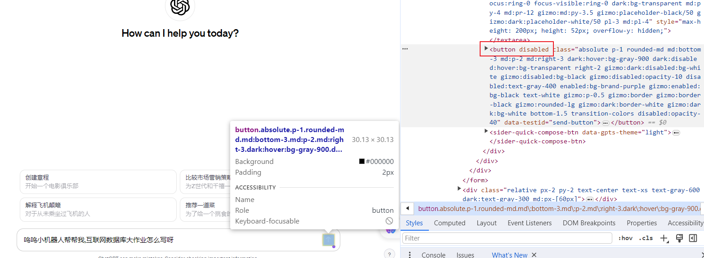

可以注意到，这个**发送button不仅没有id，并且还是是disabled**。我们首先尝试给它一个id名为ErwinZhou-GPT-send-button：

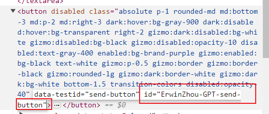

然后我们尝试通过以下方法**利用刚起好的id，先让按钮接触disabled状态，再click点击它：**

```javascript
$("#ErwinZhou-GPT-send-button").disabled=false
$("#ErwinZhou-GPT-send-button").click()
$("#ErwinZhou-GPT-send-button").click
```

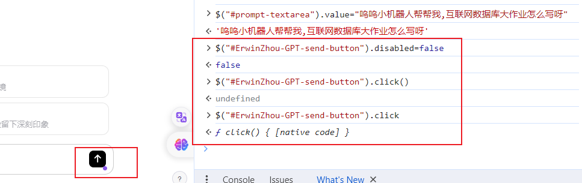

**不过看到还是没有作用，发送不了，**错误提示：*ƒ click() { [native code] }*。通过探索发现，这是因为**此处的按钮的点击事件依赖于某些特定的条件（在本处是用户输入），那么仅仅通过代码模拟点击无法触发这些事件。也就是说我只有亲自在对话框输入内容后，才能触发点击的事件。**

**<font size=3, color="red">而更深层的原因是因为对话框的类型是textarea，而不是直接的事件input，这意味着对话框本身并没有和任何事件进行绑定。</font>**

因此我需要**触发一个 `input`事件，而不仅仅是修改 `value` 属性。**这样任何依赖于这些事件的代码都会被执行。为了解决这个问题，我们**亲自定义事件**，通过以下代码亲自定义一个input类型的event，并且**和textarea通过dispatchEvent绑定**：

```javascript
var event = new Event('input', { bubbles: true }); // 创建一个新的 input 事件
$("#prompt-textarea").dispatchEvent(event)
$("#ErwinZhou-GPT-send-button").click()
```

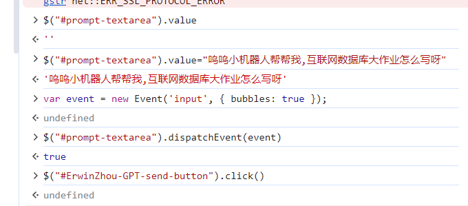

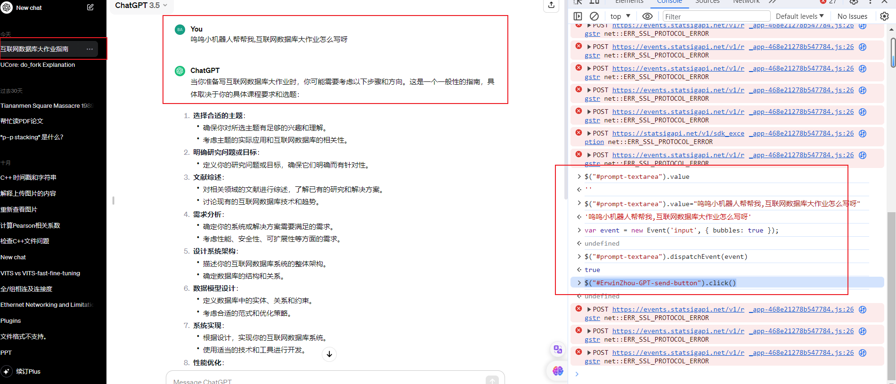

**可以看到成功向小机器人发送了对话和请求帮助，它也成功向我回复了。证明了JQuery测试的成功！**

~~不过大作业肯定还是会自己写，小机器人写代码真的不靠谱......~~

### 四.浏览器插件

#### 4.1 插件功能

1. 使用了**简单的logo作为主题icon**，用于显示内容；
2. 当在一般的页面中点击插件，会有一个**插件点开与否的提示即ON或者OFF**。
3. 如果在一般的页面中并且插件也处于打开的状态，那么此时点击屏幕的任何一个地方，**都会出现警告提示来骚扰你：“Go to ErwinZhou\'s Github HomePage, then you will see the easteregg!”**
4. 如果来到我的Github主页https://github.com/ErwinZhou，则此时点击插件会**弹窗显示一个我的个人页面。页面内容会在之后详细展示。**
5. 如果切换到正常主页，那么就会继续开始骚扰。

#### 4.2 代码实现

1. **项目架构：**本次实现**主要基于谷歌插件**，具有如下的项目架构：

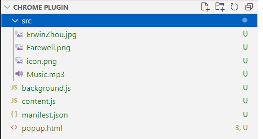

* src：
  * icon.png：插件显示的内容
  * ErwinZhou.jpg：弹窗主页图标
  * Farewell.png：弹窗主页背景
  * Music.mp3：弹窗音乐
* **manifest.json：配置文件，包含着一些基本的插件设置**，符合https://developer.chrome.com/docs/extensions/mv3/manifest/中的描述。
* **background.js：是service worker即后台服务**，主要是负责处理和监听浏览器的各类事件。后台服务可以使用所有ChromeAPI，但是不能直接与网页内容交互。在其中实现了设置**页面图片，设置点击插件状态变换和监听页面切换。**
* **content.js：**用于实现对于普通页面的骚扰，定义函数EastereggTipTrigged。
* **popup.html：**EasterEgg菜单页面，很精美！

2. **manifest.json：**

   ```javascript
   {
       "manifest_version": 3,
       "name": "ErwinZhou's first Chrome Extension",
       "version": "1.0.1",
       "description": "Trick or Treat!",
       "author": "ErwinZhou@outlook.com",
       "icons": {
           "48": "src/icon.png"
   
       },
       "background": {
           "service_worker": "background.js"
       },
       "action": {
           "default_icon": {
               "48": "src/icon.png"
           }
       },
       "permissions": [
           "scripting",
           "activeTab",
           "tab",
           "notifications",
           "storage"
       ]
   }
   ```

   * 插件名：ErwinZhou's first Chrome Extension
   * 插件描述：Trick or Treat!
   * 插件icon：src/icon.png
   * **设置权限：为了实现插件和页面的一些交互功能的必备选择。**

3. **background.js：**

   * 实现插件安装时候，**检测当前页面**，如果是我的主页即https://github.com/ErwinZhou，就不**设置OFF的样式，其它情况下设置**。

   ```javascript
   chrome.runtime.onInstalled.addListener(async () => {
       /*
       * When Chrome is installed or running(not on My HomePage)
       * It will set on "OFF" 
       */
       
      // Get all tabs that the user has open
       tabs = await chrome.tabs.query({active: true, currentWindow: true})
   	// If the current tab is not HomePage, set the badge to "OFF"
       if(!tabs[0].url.includes("https://github.com/ErwinZhou'")){
           chrome.action.setBadgeText({ "text": "OFF" })
       }
   
   })
   ```

 * * 实现在用户点击插件时候，触发对于浏览器的事件，通过检测此时的URL是否是包含https://github.com/ErwinZhou的。

     * 如果是则设置此时的弹窗是`popup.html`
     * 如果不是，首先获取当前的状态通过`chrome.action.getBadgeText`，然后将状态反转。并且如果状态此时为ON，则注入`content.js`。

     ```javascript
     chrome.action.onClicked.addListener(async (tab) => {
         /*
         * Im HomePage:
         * pop up a easteregg
         * Other cases:
         * When extension is clicked in current tab
         * Switch icon to "ON" 
         */
         if (tab.url.includes('https://github.com/ErwinZhou')) {
             chrome.action.setPopup({
                 popup: 'popup.html'
             })
         } 
         else {
         //Get Current State
         const previousState = await chrome.action.getBadgeText({ tabId: tab.id })
         const newState = previousState === 'ON' ? 'OFF' : 'ON'
     
         //Update State
         await chrome.action.setBadgeText({
             tabId: tab.id,
             text: newState
         })
         //ON -> Inject content.js
         if (newState === 'ON') {
             await chrome.scripting.executeScript({
                 target: { tabId: tab.id },
                 files: ['content.js']
             })
         }
     
         }
         
     })
     ```

* * 因为如果对于本插件设置了弹窗后，那么不论是什么页面，都会改为弹窗，此时的`onClicked`就会失效，为了避免这种情况，通过检测此时的页面，如果不是https://github.com/ErwinZhou，**那么将弹窗设置为空，恢复`onClicked`的效果。通过`onActivated`实现。**

    ```javascript
    chrome.tabs.onActivated.addListener(async (activeInfo) => {
        let tab = await chrome.tabs.get(activeInfo.tabId);
        if (!tab.url.includes('https://github.com/ErwinZhou')) {
            await chrome.action.setPopup({
                tabId: activeInfo.tabId,
                popup: ''
            });
        }
    })
    ```

4. **content.js:**定义函数`EastereggTipTrigged`，实现这个脚本被注入后，**用户点击的操作就会触发alert警告，提示去查看我的主页嘿嘿。**

   ```javascript
   const EastereggTipTrigged = () => {
       alert("Go to ErwinZhou\'s Github HomePage, then you will see the EasterEgg!")
   };
   
   document.addEventListener('click', EastereggTipTrigged);
   ```

5. **popup.html:**
   * 背景音乐：进击的巨人混曲之一，Call of Silence x YouSeeBIGGIRL - EYAir
   * 背景图片：Wallpaper Engine中由艺术家哆啦A梦绘制的《绝美的午后》，相关链接：https://steamcommunity.com/sharedfiles/filedetails/?id=1788618333

包含以下内容：

* **基本信息：**专业（Major）、学号（Student ID）、姓名（Name）。
* **相关联系方式：**微信（WeChat）、邮箱（Email）、推特（Twitter）、Github等。
* **个人logo：**和我的Github头像相同~~（艾笠党刀里找糖磕...）~~
* **音频信息：**背景音乐，**使用audio control音频控件。**
* **背景图片**：进行了简单的透明化处理，**通过在图片上添加一个半透明的覆盖层。**
* **纪念艾伦离开：Farewell, Eren Jaeger渐变字**，使用WebKit引擎的线性渐变。

代码为：

```html
<!DOCTYPE html>
<html lang="en">
<head>
    <meta charset="UTF-8">
    <meta name="viewport" content="width=device-width, initial-scale=1.0">
    <title>ErwinZhou</title>
    <style>
        body{
            text-align: center;
            /* beautiful font */
            .hcqStyle1{color:hsl(184,80%,25%);text-shadow:0 0 1px currentColor,/*highlight*/-1px -1px 1px hsl(184,80%,50%),0 -1px 1px hsl(184,80%,55%),1px -1px 1px hsl(184,80%,50%),/*light shadow*/1px 1px 1px hsl(184,80%,10%),0 1px 1px hsl(184,80%,10%),-1px 1px 1px hsl(184,80%,10%),/*outline*/-2px -2px 1px hsl(184,80%,15%),-1px -2px 1px hsl(184,80%,15%),0 -2px 1px hsl(184,80%,15%),1px -2px 1px hsl(184,80%,15%),2px -2px 1px hsl(184,80%,15%),2px -1px 1px hsl(184,80%,15%),2px 0 1px hsl(184,80%,15%),2px 1px 1px hsl(184,80%,15%),-2px 0 1px hsl(184,80%,15%),-2px -1px 1px hsl(184,80%,15%),-2px 1px 1px hsl(184,80%,15%),/*dark shadow*/2px 2px 2px hsl(184,80%,5%),1px 2px 2px hsl(184,80%,5%),0 2px 2px hsl(184,80%,5%),-1px 2px 2px hsl(184,80%,5%),-2px 2px 2px hsl(184,80%,5%)}
        }
        .profile{
            /* 虚化背景*/
            background: linear-gradient(rgba(255, 255, 255, 0.4), rgba(255, 255, 255, 0.4)), url(src/Farewell.png);
            background-attachment: fixed;
            /* 设置其不重复 */
            background-repeat: no-repeat;
            background-position: center;
            background-size:cover;
            /* 占满屏幕 */
            height: 100vh;
        }
        audio{
            /* 让音频播放器显示在右侧*/
            float: right;
        }
        /* Farewell */
        .text{
            width: 300px;
            height: 200px;
            position: absolute;
            left: 50%;
            margin-left: -150px;
            /* 使用WebKit引擎的线性渐变作为背景图像 */
            background-image: -webkit-linear-gradient(left,blue,#66ffff 10%,#cc00ff 20%,#CC00CC 30%, #CCCCFF 40%, #00FFFF 50%,#CCCCFF 60%,#CC00CC 70%,#CC00FF 80%,#66FFFF 90%,blue 100%);
            /* 将文本填充颜色设置为透明 */
            -webkit-text-fill-color: transparent;
            /* 使用WebKit引擎将背景剪裁到文本。*/
            -webkit-background-clip: text;
            -webkit-background-size: 200% 100%; 
            /* 应用一个名为"masked-animation"的无限循环动画，每次循环持续4秒，速度线性变化 */
            -webkit-animation: masked-animation 4s linear infinite;
            font-size: 30px;
        }

    </style>
</head>
<body>
    <div class="profile">
    <h1 class="hcqStyle1">ErwinZhou</h1>
    
    <div>
    <p><strong>Major: Information Security</strong></p> 
    <p><strong>Student ID: 2111408</strong></p>
    <p><strong>Name: 周钰宸 Zhou Yuchen</strong></p>
    <p><strong>Wechat: fighttillthend</strong><p>
    <p><strong>Email: batman6667@proton.me</strong></p>
    
    <p><strong><a href="https://twitter.com/ErwinZhou_">Twitter: @ErwinZhou_</a></strong></p>
    <p><strong><a href="https://github.com/ErwinZhou">GitHub: ErwinZhou</a></strong></p>
    </div>
    <h2 class="text">Farewell, Eren Jeager</h2>
    <audio controls>
        <source src="src/Music.mp3" type="audio/mpeg">
  
    </audio>
</div>
    
    
</body>
</html>
```

**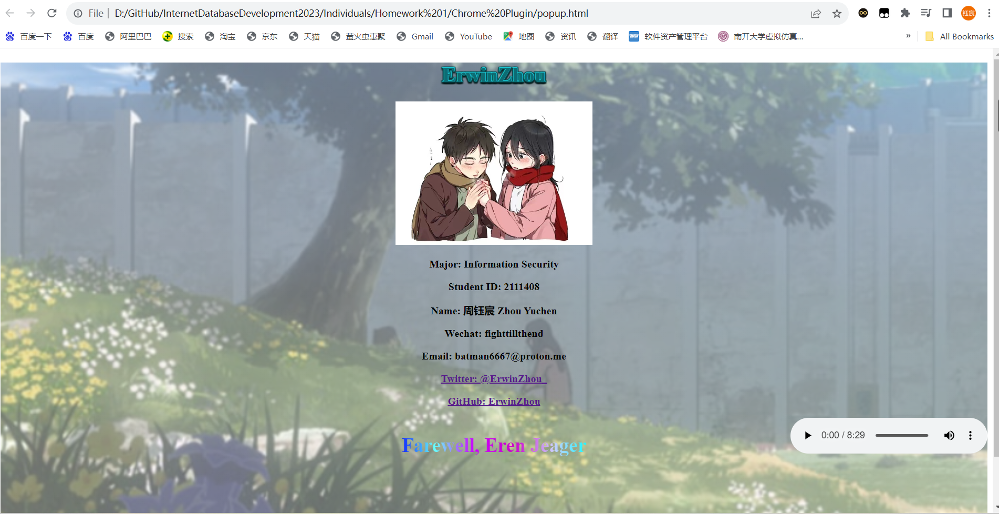**

#### 4.3 插件效果展示

1. 在谷歌拓展的**开发者页面加载插件**：可以看到对应的Logo，插件名描述等。

   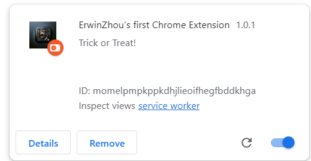

2. **查看OFF/ON效果以及一般页面的骚扰效果：**可以看到此时插件是处于OFF状态。

   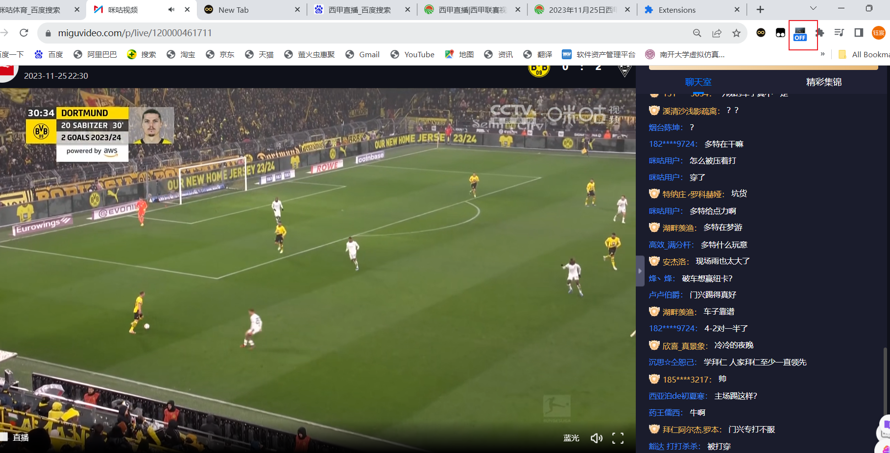此时双击一下，看到变成了ON状态。并且此时**点击屏幕任何位置都会开始骚扰hhh。**

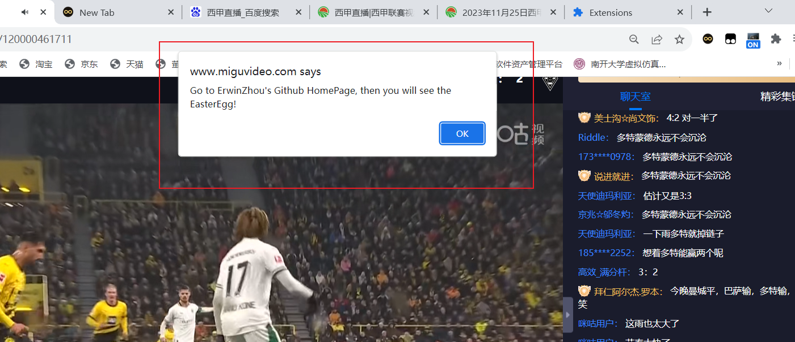

3. 查看GitHub主页的彩蛋效果：可以看到此时能够正常显示弹窗，甚至可以播放音乐。左上角的插件也没有显示OFF。
   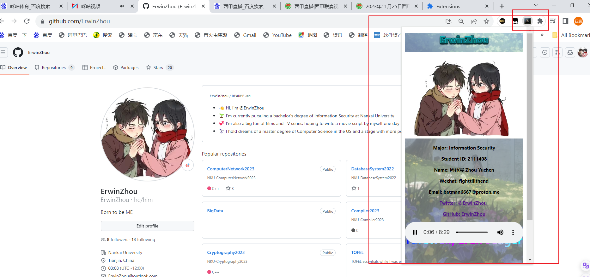

**<font size=3, color="red">到此全部插件功能展示完毕，实现非常完整和成功</font>！**