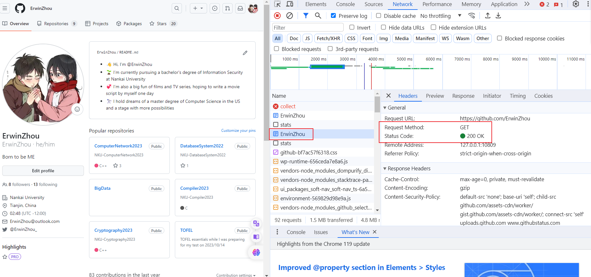
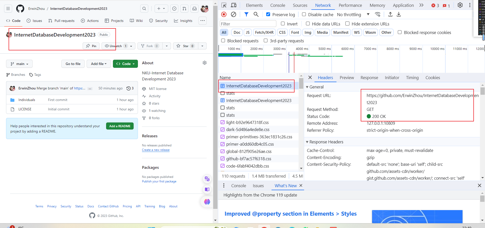

# Internet Database Development 2023

## 个人作业1——Web前端初探

### 学号：2111408 	姓名：周钰宸	专业：信息安全

### 一.作业要求

1. 针对任意网页，**调研其不同方式请求**。至少包括get、post请求，写出或截图其请求及相应数据包。
2. 针对任意网页，使用**JQuery**，能够触发某一事件。写出至少二条语句，截图响应前后不同的状态。
3. 完成一个**浏览器插件**，功能不限，文档中写明功能及代码。

### 二.网页不同请求方式调研

在Web开发中，浏览器的“session”是指在用户与网站进行交互期间创建的会话状态。当用户首次访问网站时，服务器会为其分配一个唯一的会话ID，并将其存储在用户的浏览器中。在会话期间，服务器可以使用该会话ID来跟踪用户的状态和活动，例如登录状态、购物车内容等。会话通常在用户关闭浏览器或注销时结束，或者在一段时间内没有活动时过期。会话可以通过浏览器的cookie或URL重写来实现。

### 三.JQuery

### 四.浏览器插件