# Internet Database Development 2023

## 个人作业2——Web前端设计

### 学号：2111408 	姓名：周钰宸	专业：信息安全

### 一.作业要求

1. 使用**Axure**等软件设计某个页面。
2. 为团队选取一个**前台及后台模板。**

### 二.Axure网页设计

本次计划使用Axure完成一个简单的个人主页，不过由于时间受限，只搭出了一个简单的框架，未来会持续完善。

#### 2.1 Axure下载

本次实验选择的是从**官网下载的Axure RP10**，由**学生包获取了免费订阅**。

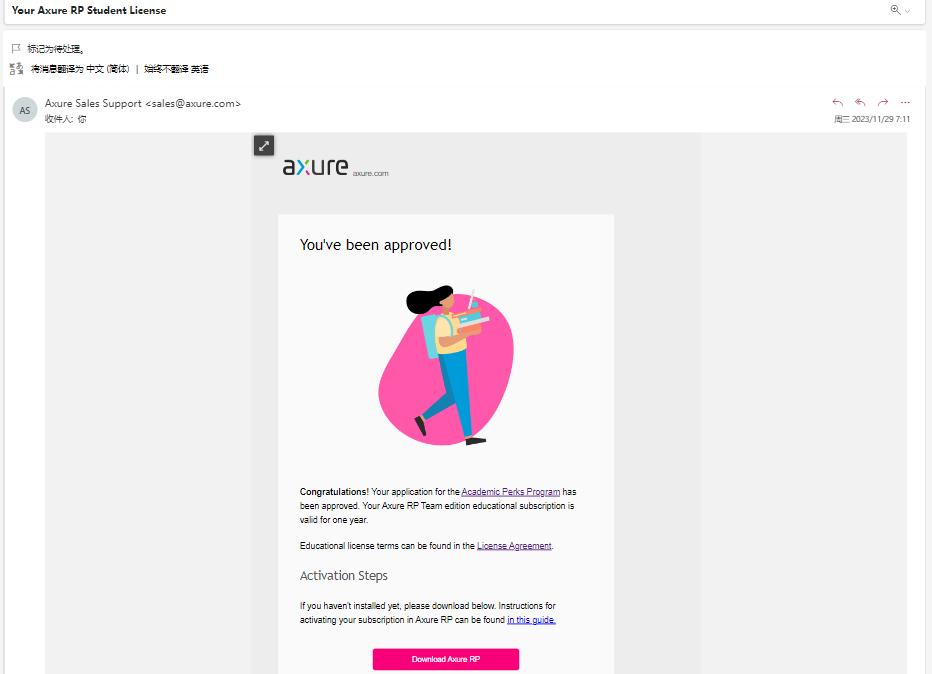

#### 2.2 页面框架

本次实验目标是**设计一个关于我自己全面的个人展示与介绍**。不仅是为了**让别人更加了解我，也是为了我能更好地探索自己的兴趣，并记录一些有意义的生活学习等瞬间**。框架分为以下几个组成部分：

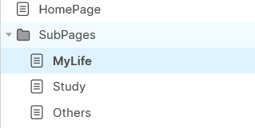

1. HomePage：主页面
2. SubPages（子页面）：由主页面跳转而来，一共有以下三个。
   * MyLife：个人生活。
   * Study：学习工作。
   * Others：兴趣擅长的东西等。

#### 2.3 主页面设计

1. **主页面最终展示效果如下：**

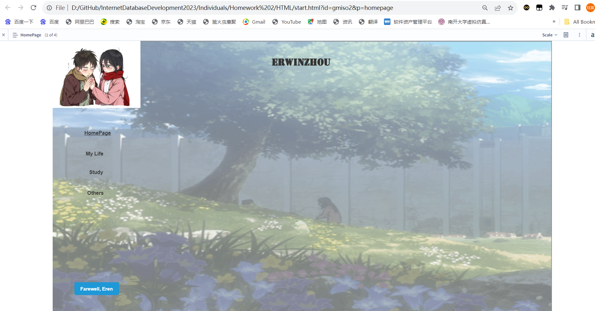

2. 背景图片和个人Logo：通过图片与设置透明度和调整放置顺序实现。

3. **导航条：**设置一共四个页面的导航条，**现在因为在主界面所以设计为HomePage加粗。**

   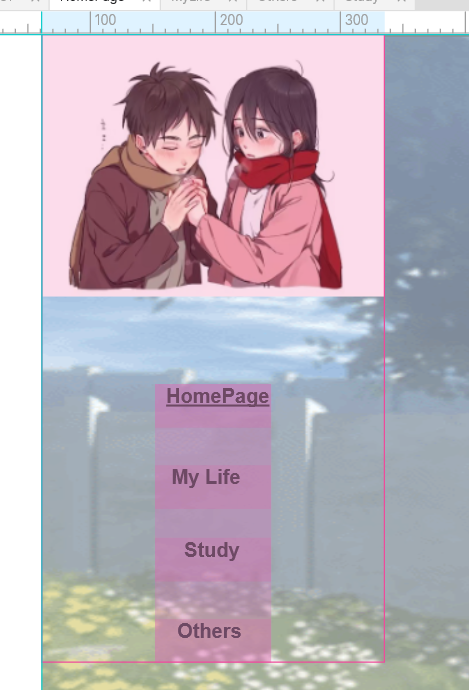

4. **音频播放：使用按钮与内联框架实现。**具体而言：

   * 这里使用**内联框架**是因为如果只使用一个按钮打开对应的音乐，会发生页面跳转，这不是我们想要的。

   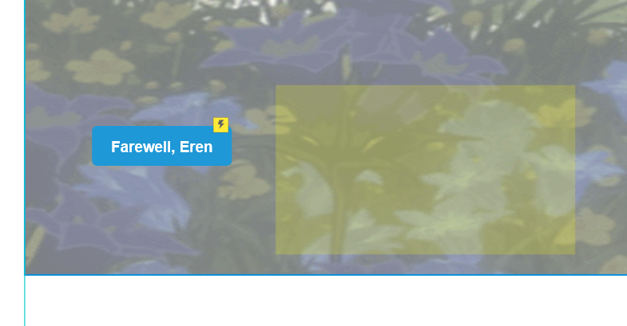

   因此使用内联框架可以实现在内联框架中打开，而不是打开一个新的页面。**方法是添加一个新的交互，点击按钮时候实现“在框架中打开连接。”**

   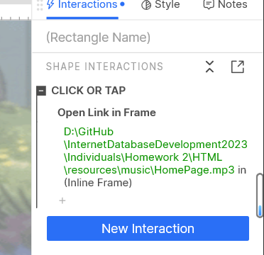

#### 2.4 多页面交互设计

1. **整体页面跳转效果：**为了实现整体页面的跳转，即点击一个按钮跳转到对应的页面，需要在**导航条加上交互。**

2. **同时为了避免导航条重复设计，使用建立组件实现。**

   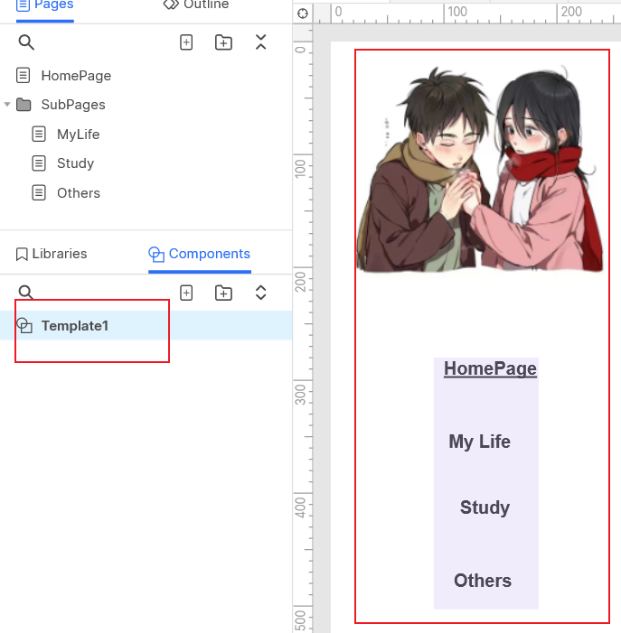

3.为了实现在不同的页面实现，导航条显示的内容不同，即在不同的页面将不同的标签加粗。**具体实现方法是使用动态面板。**

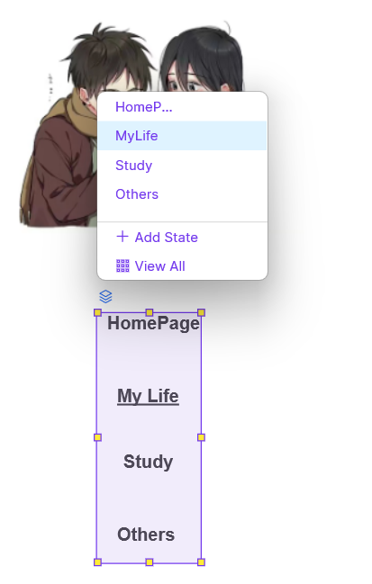

**为每个对应页面设计一个独立的状态，更改对应的字体。最终结果如下：**

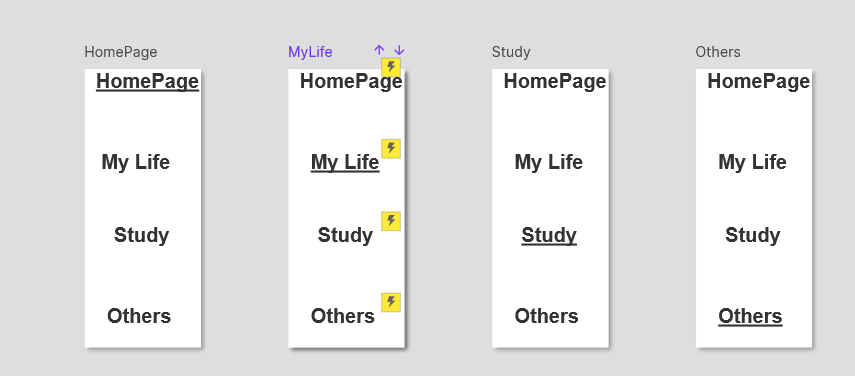

#### 2.5 其它页面设计

1. **My Life（个人生活）：**同样加入对应的Logo，背景图片等，**可以看到左侧的导航条多了一个MyLife下面的横线，是标注现在所处的页面。**

   除此之外，在上面**多了一个搜索栏（由TextFiled+Button组合），是为了方便后面拓展，实现更好地对我生活的了解和检索。**

   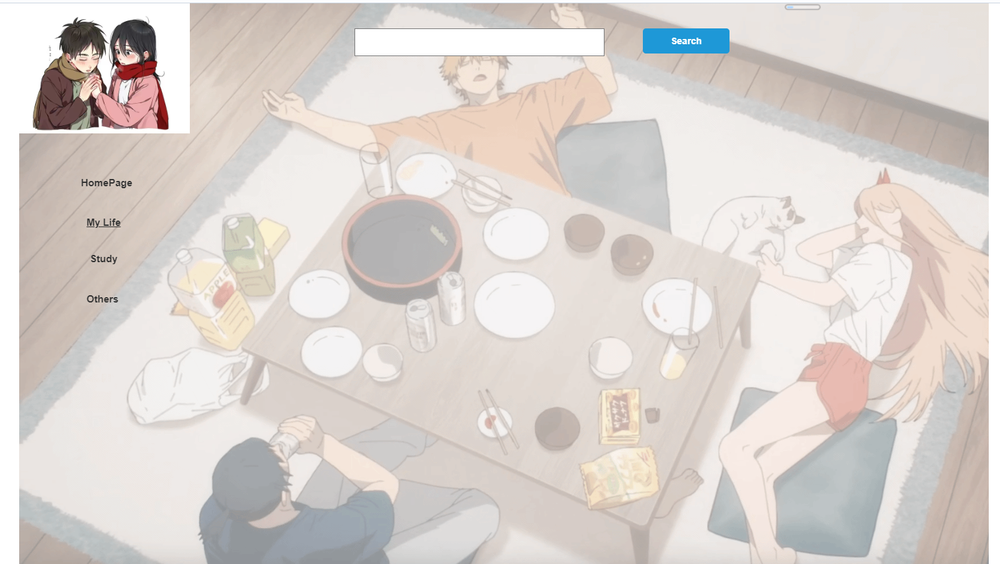

2. **Study（学习与工作）：**这里除了同样的背景图片和Logo外，也能看到对应的导航栏变化。

   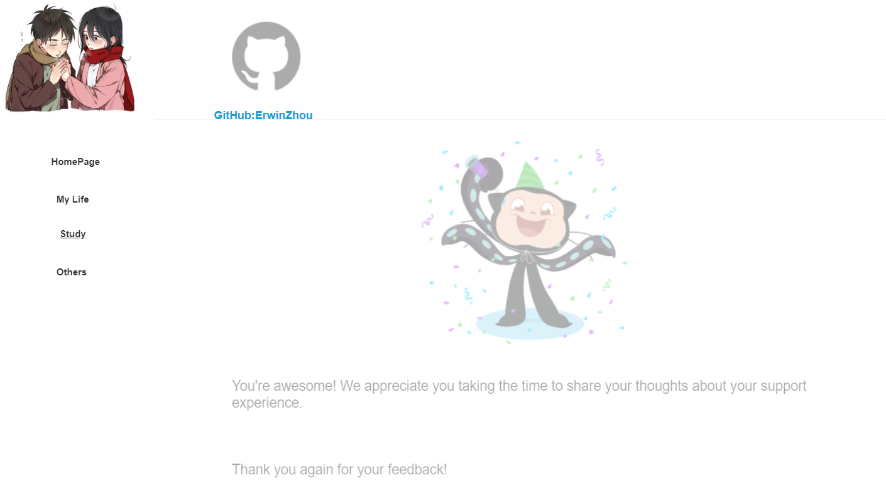

   除此之外，可以看到GitHub小猫下有一个对应的链接按钮。**我设计交互为点击按钮跳转到页面我的GitHub主页：**

   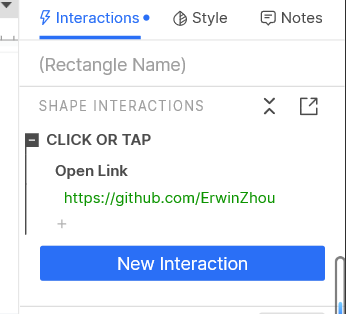

   **值得一提的是，这个背景图片可是有讲究的hhh**。当初我第一次注册GitHub告诉我不能对第三方平台进行授权，检测我的账户存在问题。后来我对客服发送消息与其对话才最终实现了问题的解决。**是我实际上第一次与跨越大洋的人进行对话的经历，对我十分具有纪念意义。**

   3. **Other（其它）：目的主要是包含我的一些个人兴趣以及爱好等。**

      背景图片选择了**我很喜欢的一首歌《Take Me with You》的封面**，作者[Fleurie](https://music.163.com/artist?id=860929) / [Ruslan](https://music.163.com/artist?id=816254)。孤寂而空旷的宇宙和牵起手的两个宇航员。和歌名《Take Me with You》相得益彰，**与我个人浪漫与喜欢自由和风格十分契合。因此选择了这张图片。**

      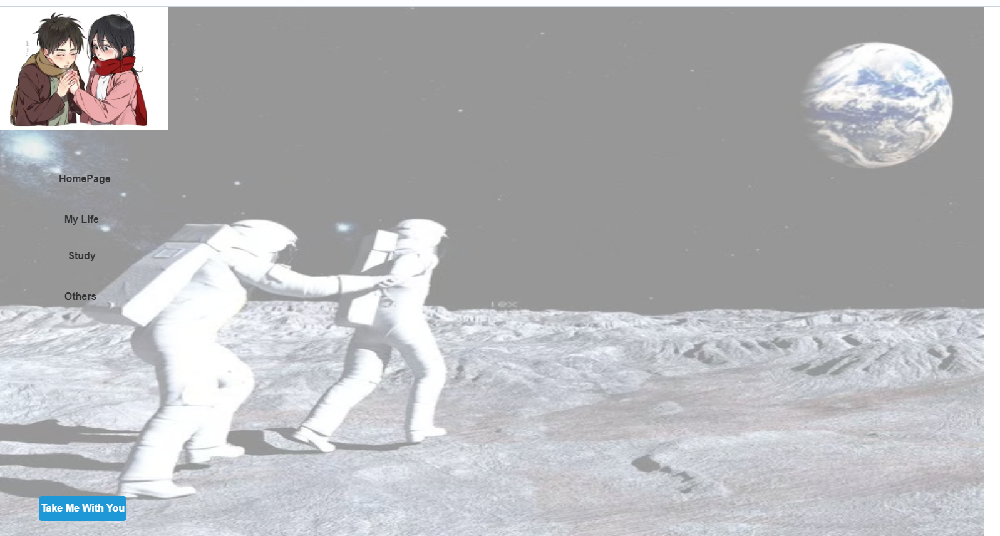

      除了对应的导航栏变化后，**音乐的播放也是通过和主页一样的内联框架实现，这里不再重复。**

      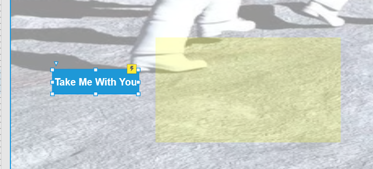

#### 2.6 总体效果

**最后在这里对总体效果进行展示：**

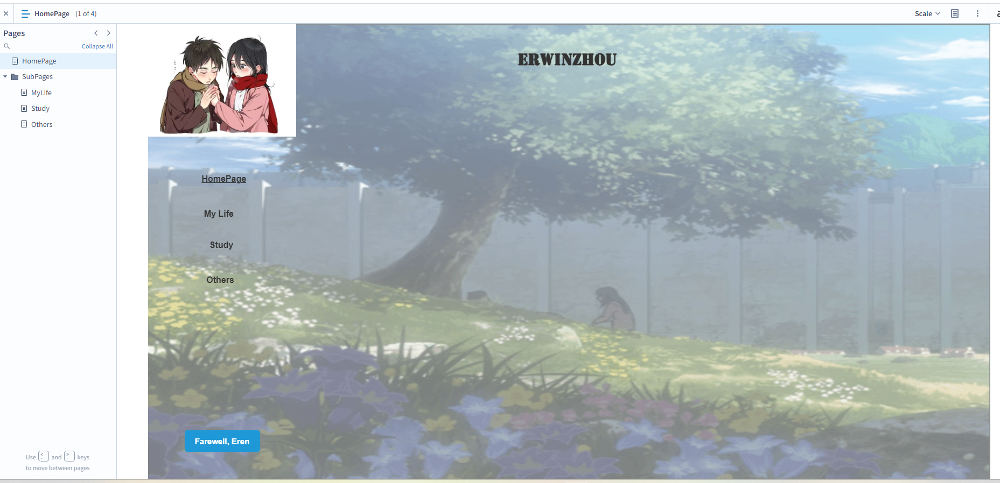

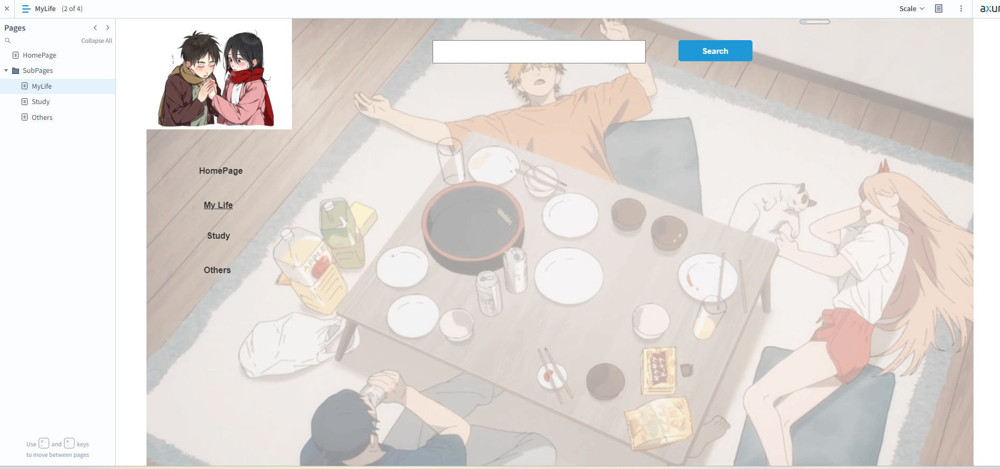

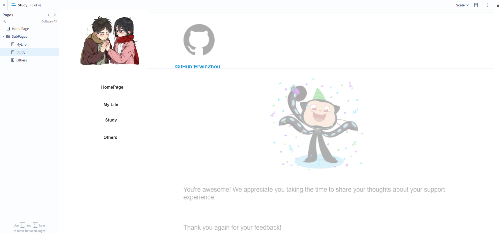

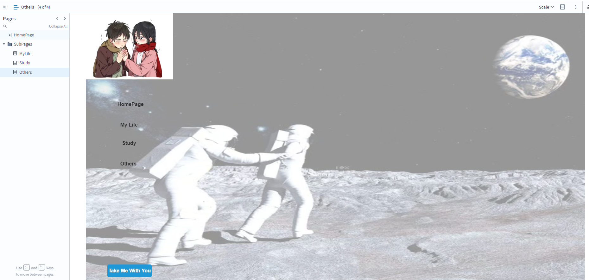

**总结一下实现的功能如下：**

1. 总体四个页面，交互实现点击按钮的**页面跳转**。
2. **内联框架**实现音乐的播放。
3. **动态面板**实现导航栏状态的变化。
4. 不同页面的**背景图片与Logo**。
5. 链接的跳转。
6. 搜索个人信息的检索。

**总体来说，框架实现较完整，不过内容有待填充，会未来在我的仓库持续完善。**

### 三.模板挑选

这里为了能够之后让团队的项目更有效率的实现，为团体预先选择了一些模板，具体来源主要来自Github。**后面会和团队成员一起商量挑选一个最为满意的作为前台和后台的模板。**

1. **后台模板：**通用的yii2后台，基于Yii2的advanced应用程序模板。

   ​		成型后的系统包括文章、商城、单页、广告、购物车、订单、标签、评论、推荐位、艾特@、消息、支付和回调、后台rbac、后台行为日志、数据可视化、配置管理等、前台用户中心、会员积分等功能。

**考虑到其界面的完整性，并且利用了Yii2的大部分功能，这里可以着重对其未来是否作为模板进行考量。**

GitHub链接为：https://github.com/e282486518/yii2admin

2. **前台模板：**这里选择的前台模板为如下仓库。

   Yii 2高级项目模板，模板包括四个层：接口(实现 RESTful 风格的 Web Service 服务的 API)，远程过程调用(Hprose)，前端，后端和控制台，每个都是单独的Yii应用程序。
   
   

Github链接为：https://github.com/shuijingwan/yii2-app-advanced