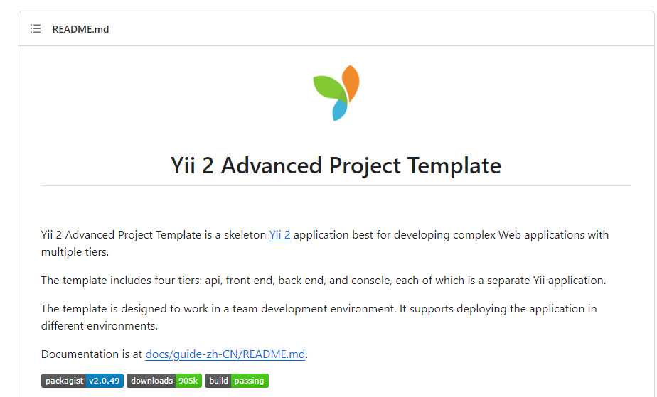

# Internet Database Development 2023

## 个人作业2——Web前端设计

### 学号：2111408 	姓名：周钰宸	专业：信息安全

### 一.作业要求

1. 使用**Axure**等软件设计某个页面。
2. 为团队选取一个**前台及后台模板。**

### 二.Axure网页设计

### 三.模板挑选

这里为了能够之后让团队的项目更有效率的实现，为团体预先选择了一些模板，具体来源主要来自Github。**后面会和团队成员一起商量挑选一个最为满意的作为前台和后台的模板。**

1. **后台模板：**通用的yii2后台，基于Yii2的advanced应用程序模板。

   ​		成型后的系统包括文章、商城、单页、广告、购物车、订单、标签、评论、推荐位、艾特@、消息、支付和回调、后台rbac、后台行为日志、数据可视化、配置管理等、前台用户中心、会员积分等功能。

**考虑到其界面的完整性，并且利用了Yii2的大部分功能，这里可以着重对其未来是否作为模板进行考量。**

GitHub链接为：https://github.com/e282486518/yii2admin

2. **前台模板：**这里选择的前台模板为如下仓库。

   Yii 2高级项目模板，模板包括四个层：接口(实现 RESTful 风格的 Web Service 服务的 API)，远程过程调用(Hprose)，前端，后端和控制台，每个都是单独的Yii应用程序。
   
   

Github链接为：https://github.com/shuijingwan/yii2-app-advanced