# Internet Database Development 2023

## 个人作业3——开源建站工具初试文档

### 学号：2111408 	姓名：周钰宸	专业：信息安全

### 一.实验要求

1. 自行安装**WordPress**并随意**安装模块、设计布局**。
2. 记录**安装步骤及最终页面。**

### 二.WordPress安装

**==由于之前上课跟着乜老师完成了一部分安装工作，因此这里可能会省略部分步骤。==**

1. **下载并解压WordPress：**

   只需从官网 https://wordpress.org/download/下载最新版的WordPress。然后将压缩包解压到**xampp的htdocs文件夹**下即可。这样可以使用XAMPP的环境集成。

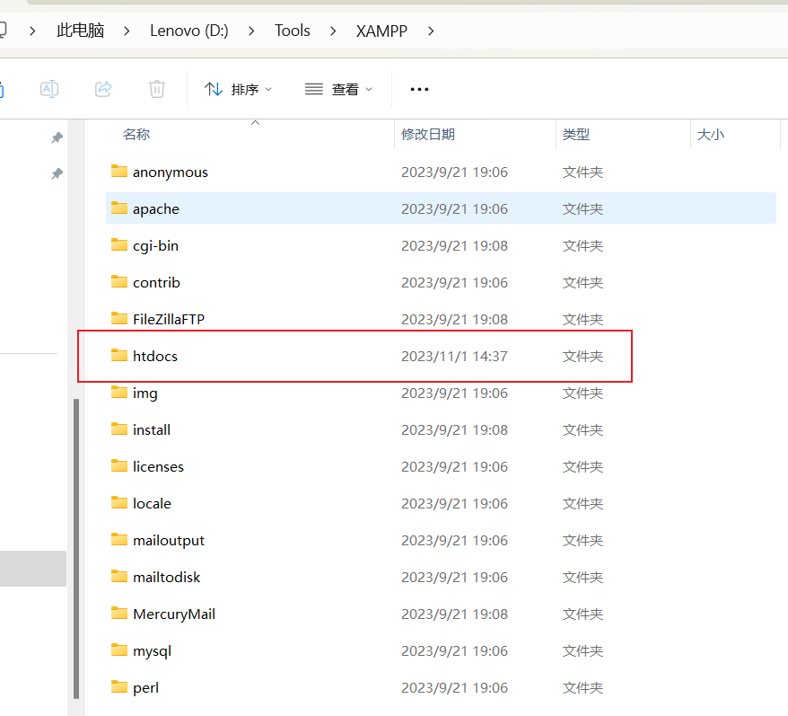

2. **初始化WordPress配置并安装：**

* 接下来需要通过浏览器访问网址 http://localhost:80/wordpress 就可以进入wordpress的初始化页面。此时让我们去搞一个本地数据库。

   

* 然后是创建一个**本地的MySQL数据库**，供WordPress使用，**我这里使用的是Navicat创建的名为`wordpress2023`的数据库。里面存储的wp_开头的数据库就是一些相关数据。**

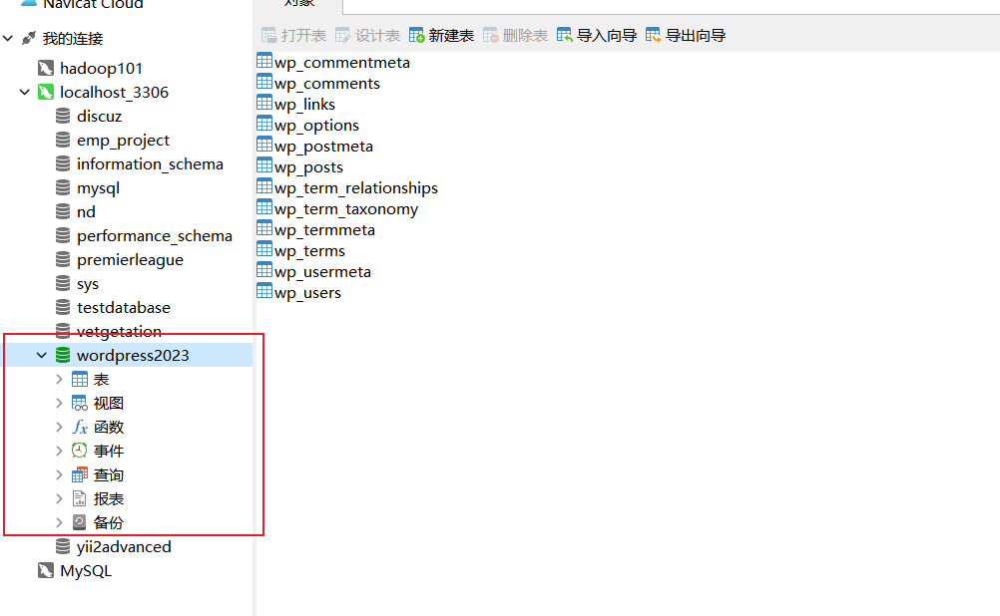

* 创建数据库完成后，在WordPress中输入一些**数据库连接信息即可**。最后**运行安装程序**。

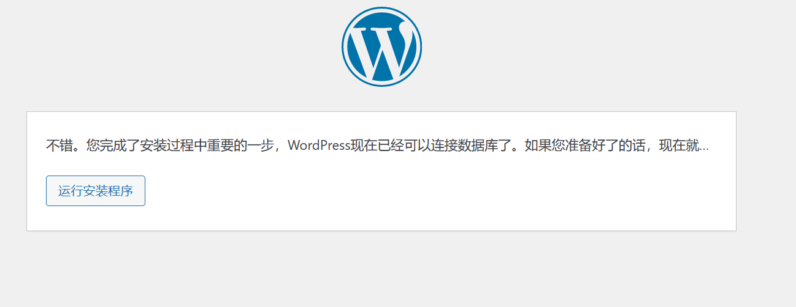

3. **安装结束后：**一般安装结束后，每次就会进入到这样的登陆页面。**我的Admin就是这个Batman**，~~因为我是一个蝙蝠侠粉丝（老爷万岁！）~~

   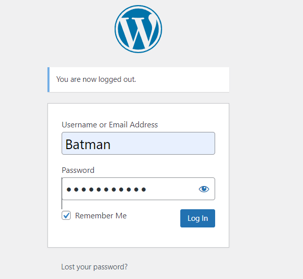

* 此时在**主页的仪表盘**就会像是这个样子。左边导航栏有很多选项，**到此就安装结束可以开始工作啦。**

   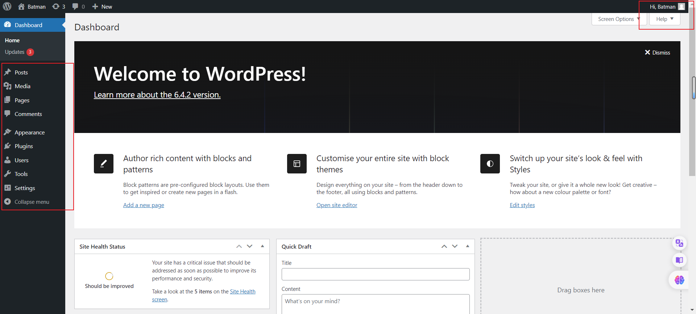

### 三.WordPress布局设计

最开始的页面就是这个样子的，很简单，一大大的"Hello world!"我们要做的就是**在这个基础上进一步更改和美化，并具有我自己的风格。**

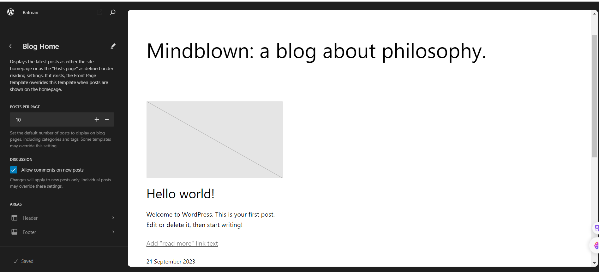

1. 选择主题：我先在Appearance里面选择一个合适好看的主题，**这里我选择的主题名为`Colibri WP`，背景宏伟的图片和简约的风格是吸引我的地方。**我们安装后启用。

   

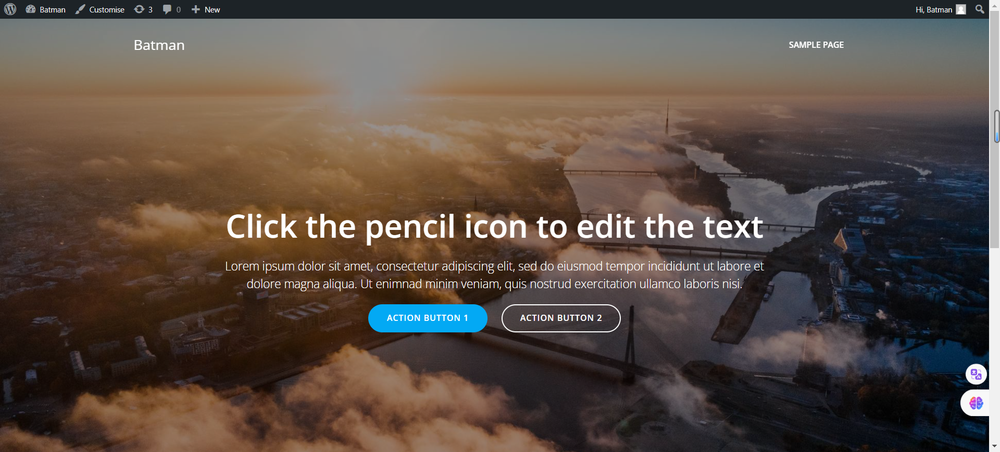

2. **设计为自己的风格：**

   * 在这之后，我目的是在**此基础上安装插件并进行设计布局**，为自己打造一个基础页面。我选择的是《Attack On Titan》这个熟悉的主题。我先更换了**页面背景**，并在中间加入了一个我的**个人logo**。

     在Logo下面，我加入了**我喜欢的一些Slogan**，具有个人风格。

   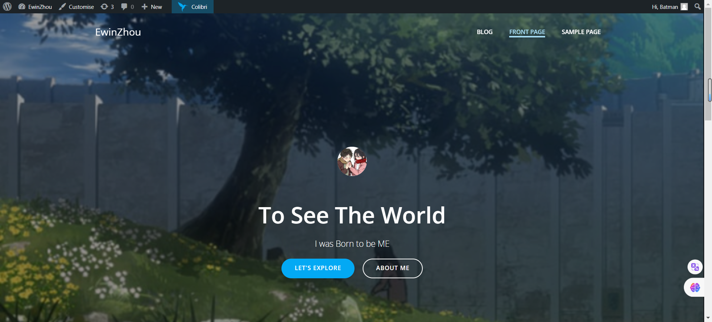

   * 然后**我添加了一个==块布局==**，并在其上添加了四个部分，其中**每个部分加入了一个logo，对应的四个部分就是我的GitHub，Twitter，Instagram和Wechat。并加上了简洁的短语加以描述。**

     并且设置了每个部分都点击后可以跳转至一个新的URL资源，即我的对应前三个主页。

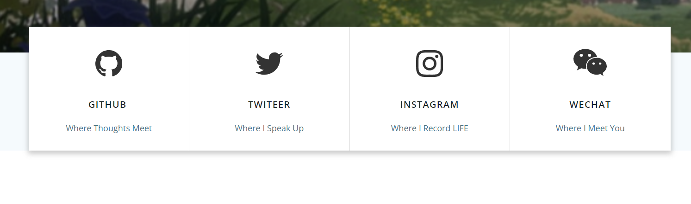

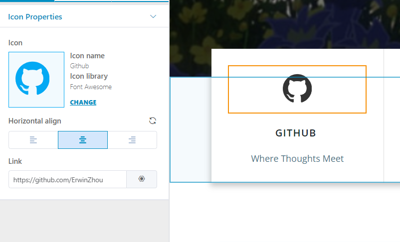

### 四.WordPress页面展示

**本次由于时间原因，有待进一步完善**，可以设置页面跳转到Blog和Sample Page等。

**暂时最终的结果如下，我觉得还是很有个人风格的：**

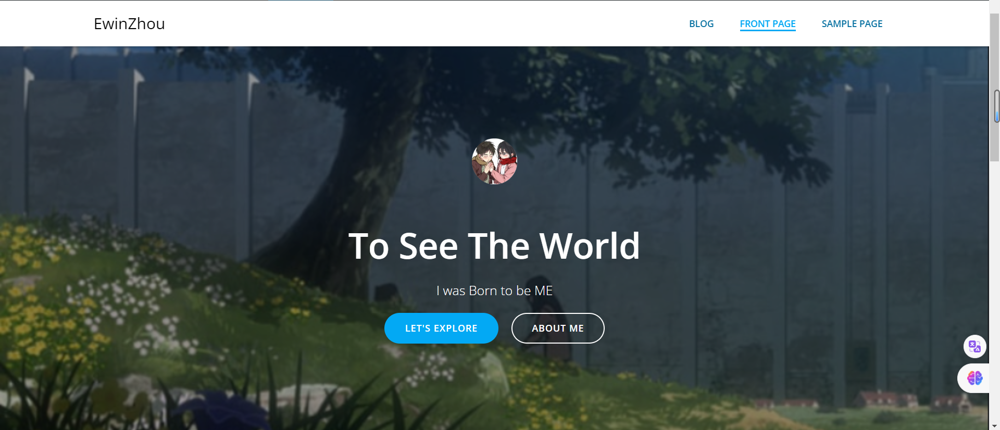

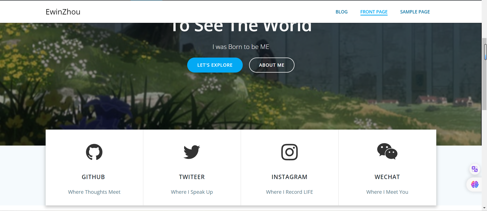

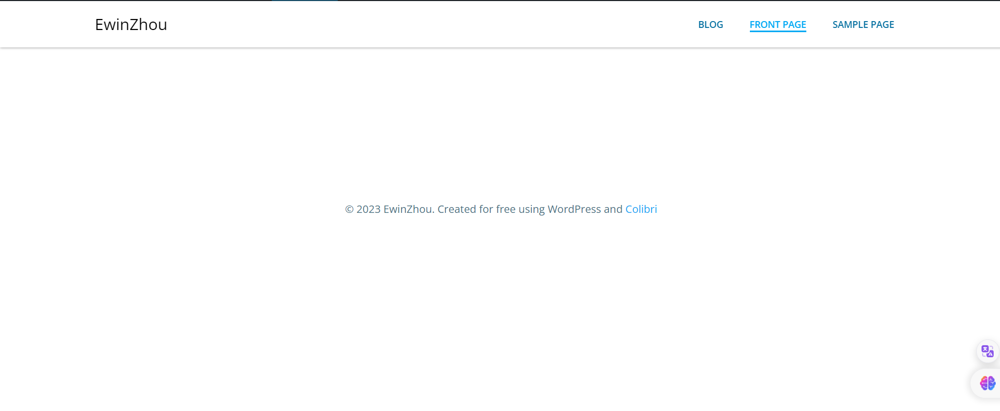